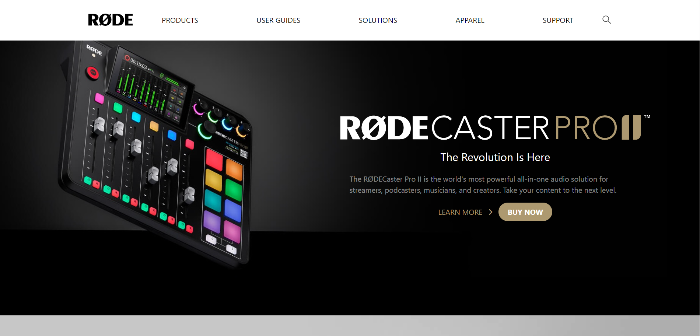
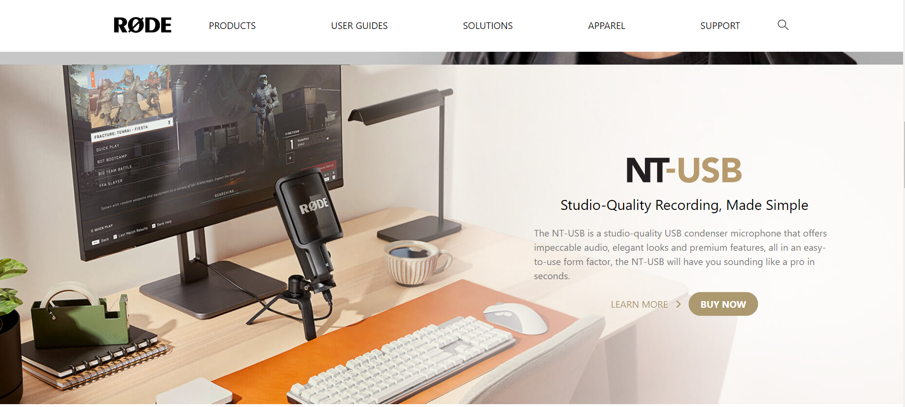
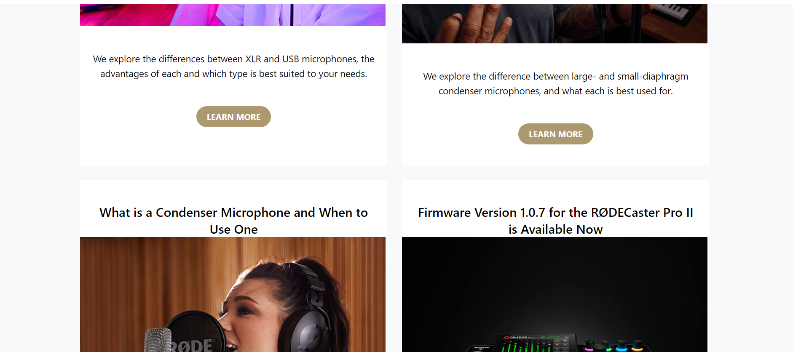
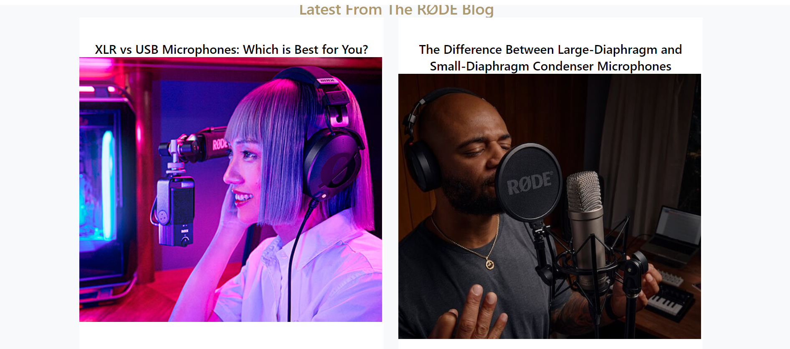
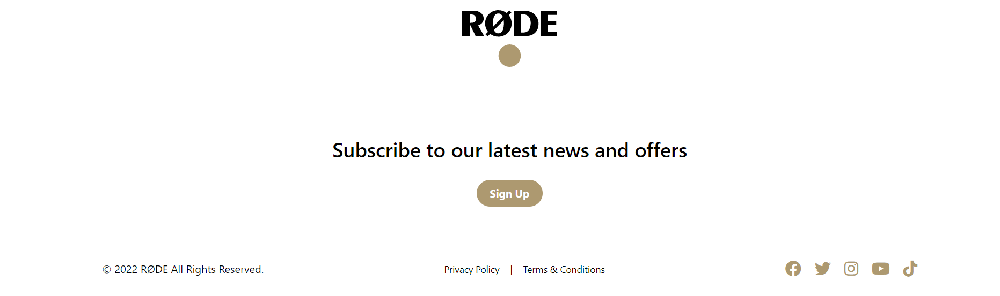
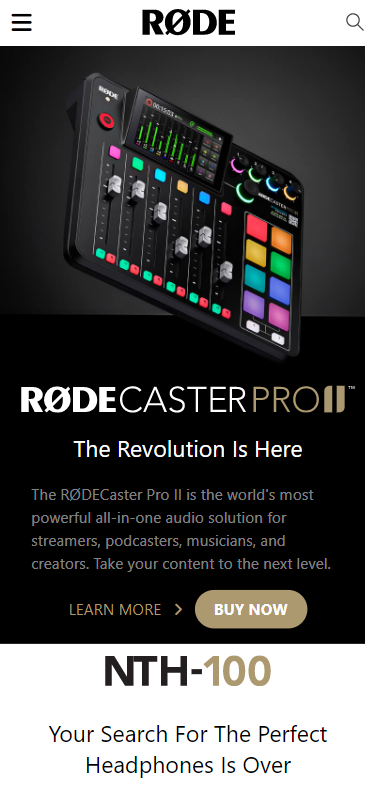
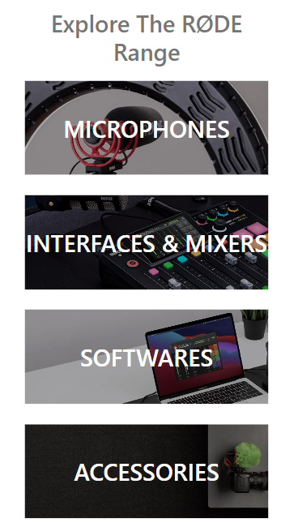
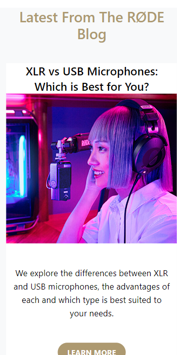
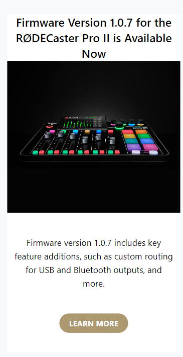
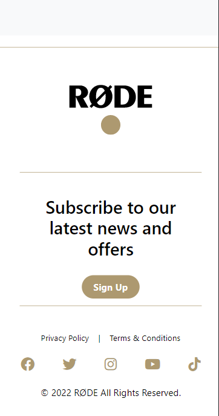

# RODE-Clone

**I have develop a UI of Rode home page.**

> What is Rode? Rode is an awesome microphone manufacturer with a well-rounded catalogue of microphones to choose from. Their professional mics range from affordable for the project studio to top-of-the-line for the professional studio and are regularly used around the world.

## Technologies Used:

> HTML  
> CSS  
> Tailwind CSS

## Features:

- Responsive
- Short and Simple
- Under 350 lines of code

## Time Taken:

This project has taken total time of around 8 hours from scratch.

## Some Screenshots are attached here:

### **Desktop**:

# **Mobile**:

## Here are some screenshots of mobile view:

